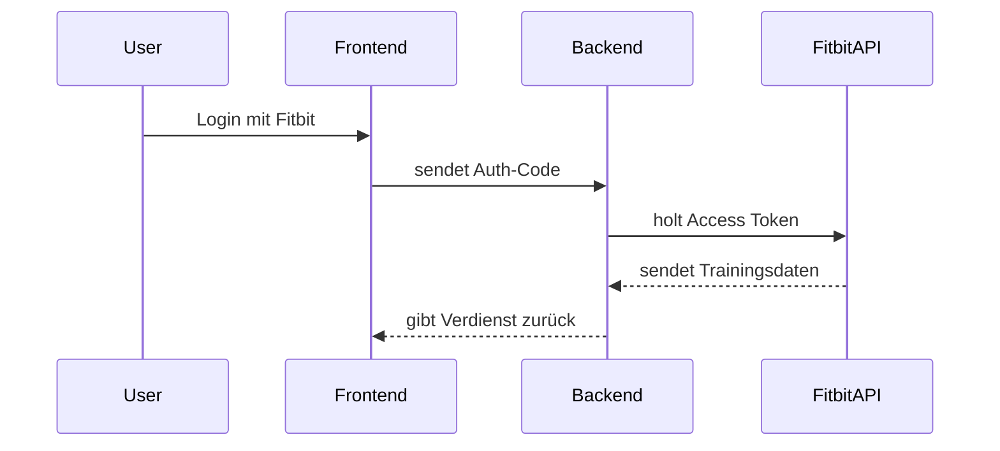

# fitpay

## Systemarchitektur

Das Projekt **FitPay** automatisiert das Erfassen von Fitbit-Trainings und berechnet daraus den Verdienst des Nutzers.

| Schicht     | Technologie       | Beschreibung                |
|-------------|-------------------|-----------------------------|
| Frontend    | React + Tailwind  | Dashboard mit Statistiken   |
| Backend     | Node.js / Express | API, Logik, Auth            |
| Datenbank   | Firebase          | Speicherung von Aktivitäten |
| Integration | Fitbit API        | Trainingsdatenquelle        |



## Database

### Local setup

```
docker pull postgres
docker network ls
docker run -it --rm --network bridge postgres psql -h 172.17.0.2 -U postgres
CREATE DATABASE fitpaydb;
CREATE USER fitpaydb_user WITH PASSWORD 'mysecretpassword';
GRANT ALL PRIVILEGES ON DATABASE fitpaydb TO fitpaydb_user;

docker run --name fit-pay-pg-db \
  -e POSTGRES_PASSWORD=mysecretpassword \
  -e POSTGRES_DB=fitpaydb \
  -e POSTGRES_USER=fitpaydb_user \
  -p 5432:5432 \
  -d postgres
  
docker run -it --rm --network bridge postgres \
  psql -h 172.17.0.2 -U fitpaydb_user -d fitpaydb

# mock fitpay server
postman-local --collection fitpay.postman_collection.json --port 3555

```

### Remote

